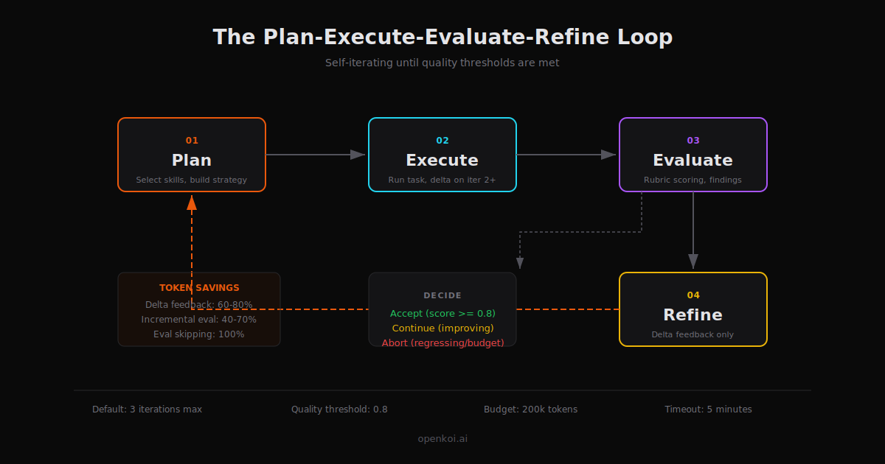

# OpenKoi

[](https://github.com/openkoi-ai/openkoi/actions/workflows/ci.yml)
[](https://crates.io/crates/openkoi)
[](https://crates.io/crates/openkoi)
[](https://github.com/openkoi-ai/openkoi/releases)
[](LICENSE)
[](https://openkoi.ai)

A self-iterating AI agent system. Single binary, local-first, model-agnostic.

OpenKoi follows a **Plan-Execute-Evaluate-Refine** cycle — iterating on its own output until results meet your quality standards. It ships as a single static binary with zero runtime dependencies.



## Quick Start

```bash
# Install via Cargo
cargo install openkoi

# Or use the shell installer
curl -fsSL https://openkoi.ai/install.sh | sh
```

```bash
openkoi "Refactor the auth module to use JWT tokens"
```

OpenKoi detects your API keys from the environment, picks the best available model, and starts working. No config file needed.

## Features

- **Self-iteration** — Plan, execute, evaluate, refine. The agent is its own reviewer.
- **8+ providers** — Anthropic, OpenAI, Google, Ollama, AWS Bedrock, Groq, DeepSeek, Moonshot/Kimi, and any OpenAI-compatible endpoint.
- **Dynamic model discovery** — Probes provider APIs for available models, caches results locally. Fuzzy validation with "did you mean?" suggestions for typos.
- **Role-based models** — Assign different models to executor, evaluator, planner, and embedder roles. Auto-resolves a small/fast model for cost-sensitive internal tasks.
- **Automatic retry** — Rate limits, server errors, and timeouts are retried with exponential backoff and jitter. Context overflow is detected and handled separately.
- **Real-time progress** — Structured progress output on stderr showing plan, iterations, scores, tool calls, and costs. Suppress with `--quiet`.
- **Live task monitoring** — `openkoi status --live` polls the running task every second with a progress bar, score, cost, and recent history.
- **Task state persistence** — Current task state written to `~/.openkoi/state/current-task.json`; completed tasks appended to `task-history.jsonl` with auto-rotation.
- **HTTP API** — Localhost REST API (port 9742) for submitting tasks, querying status, and reading cost data. Optional Bearer token auth.
- **Webhooks** — Fire HTTP callbacks on `task.complete`, `task.failed`, and `budget.warning` events.
- **Smart truncation** — Tool outputs exceeding 2000 lines or 50KB are truncated with the full output saved to `~/.openkoi/tool-output/`.
- **Context overflow handling** — Detects overflow errors from all major providers and prunes context instead of failing.
- **Persistent memory** — SQLite + vector search. Learnings persist across sessions.
- **Pattern mining** — Observes your usage, proposes new skills to automate recurring workflows.
- **Skill system** — OpenClaw-compatible `.SKILL.md` format. Write once, use with any provider.
- **Rich messaging** — Slack, Discord, and Telegram integrations send structured task results with fields, colors, and thread support.
- **3-tier plugins** — MCP (external tools), WASM (sandboxed), Rhai (scripting).
- **10 integrations** — Slack, Discord, MS Teams, GitHub, Jira, Linear, Notion, Google Docs, Telegram, Email.
- **TUI dashboard** — Real-time view of tasks, costs, learnings, plugins, and config.
- **Soul system** — Optional personality that evolves with your interaction patterns.

## CLI

```bash
openkoi "task"              # Run a task (default 3 iterations)
openkoi chat                # Interactive REPL
openkoi learn               # Review proposed skills (interactive picker)
openkoi status              # Show costs, memory, active models
openkoi status --live       # Watch the running task in real-time
openkoi status --costs      # Show cost tracking summary
openkoi doctor              # Run diagnostics
openkoi connect             # Interactive picker: choose provider or integration
openkoi connect copilot     # Login to GitHub Copilot (direct)
openkoi connect chatgpt     # Login to ChatGPT Plus/Pro (direct)
openkoi disconnect          # Interactive picker: choose from connected providers
openkoi disconnect copilot  # Remove stored credentials (direct)
openkoi daemon              # Interactive picker: start/stop/status
openkoi export              # Interactive picker: choose target and format
openkoi export all          # Export all data as JSON (direct)
openkoi -m ?                # Interactive model picker
openkoi --select-model      # Same as -m ?
openkoi update              # Self-update
```

### Task flags

```bash
openkoi "task" -i 5               # Set max iterations (default 3)
openkoi "task" --quality 0.9      # Set quality threshold (default 0.8)
openkoi "task" --quiet            # Suppress progress output; only emit final result
openkoi "task" -m claude-sonnet-4 # Use a specific model
```

All commands that accept an argument also work without one — omitting the argument shows an interactive selection menu. Explicit arguments still work exactly as before.

## Providers

### Subscription-based (OAuth login, free with your existing plan)

Use `openkoi connect` to authenticate via device-code flow. No API key needed.

| Provider | Command | Flow |
|----------|---------|------|
| GitHub Copilot | `openkoi connect copilot` | Device code (GitHub login) |
| ChatGPT Plus/Pro | `openkoi connect chatgpt` | Device code (OpenAI login) |

Tokens are stored in `~/.openkoi/auth.json` and refreshed automatically.

### API key providers

Set an environment variable or paste a key when prompted during `openkoi init`.

| Provider | Environment Variable |
|----------|---------------------|
| Anthropic | `ANTHROPIC_API_KEY` |
| OpenAI | `OPENAI_API_KEY` |
| Google | `GOOGLE_API_KEY` |
| AWS Bedrock | `AWS_ACCESS_KEY_ID` + `AWS_SECRET_ACCESS_KEY` |
| Groq | `GROQ_API_KEY` |
| OpenRouter | `OPENROUTER_API_KEY` |
| Together | `TOGETHER_API_KEY` |
| DeepSeek | `DEEPSEEK_API_KEY` |
| Moonshot/Kimi | `MOONSHOT_API_KEY` |
| xAI | `XAI_API_KEY` |
| Qwen | `QWEN_API_KEY` |

API keys are saved to `~/.openkoi/credentials/<provider>.key` (owner-only permissions).

### Local

| Provider | Setup |
|----------|-------|
| Ollama | Auto-detected at `localhost:11434` |
| Custom (OpenAI-compatible) | `openkoi connect` picker or `config.toml` |

## Credential Discovery

OpenKoi auto-discovers credentials in this order:

1. **Environment variables** — `ANTHROPIC_API_KEY`, `OPENAI_API_KEY`, `GOOGLE_API_KEY`, etc.
2. **OAuth store** — GitHub Copilot, ChatGPT tokens from `openkoi connect`
3. **External CLIs** — Claude CLI (`~/.claude/.credentials.json`), Qwen CLI
4. **macOS Keychain** — Claude Code credentials (macOS only)
5. **Saved credentials** — `~/.openkoi/credentials/*.key`
6. **Local probes** — Ollama at `localhost:11434`

### Connect and Disconnect

```bash
# Interactive picker (shows all providers and integrations)
openkoi connect

# Or specify directly
openkoi connect copilot     # GitHub Copilot
openkoi connect chatgpt     # ChatGPT Plus/Pro

# Interactive disconnect (shows only currently connected providers)
openkoi disconnect

# Or specify directly
openkoi disconnect copilot
openkoi disconnect chatgpt
openkoi disconnect anthropic   # Remove saved API key
openkoi disconnect all         # Remove all OAuth tokens

# Show connection status
openkoi connect status
```

## HTTP API

The daemon exposes a localhost REST API on port 9742 for external tools, scripts, and web UIs.

| Method | Endpoint | Description |
|--------|----------|-------------|
| `POST` | `/api/v1/tasks` | Submit a new task |
| `GET` | `/api/v1/tasks` | List recent tasks |
| `GET` | `/api/v1/tasks/{id}` | Get task details |
| `POST` | `/api/v1/tasks/{id}/cancel` | Cancel a running task |
| `GET` | `/api/v1/status` | System status (version, daemon state, active task) |
| `GET` | `/api/v1/cost` | Cost summary for last 24 hours |
| `GET` | `/api/v1/health` | Health check |

```bash
# Submit a task
curl -X POST http://localhost:9742/api/v1/tasks \
  -H "Content-Type: application/json" \
  -d '{"description": "Fix the login bug", "max_iterations": 5}'

# Check status
curl http://localhost:9742/api/v1/status
```

Configure in `config.toml`:

```toml
[api]
enabled = true
port = 9742
token = "your-secret-token"  # Optional Bearer auth

[api.webhooks]
on_task_complete = "https://example.com/hooks/complete"
on_task_failed = "https://example.com/hooks/failed"
on_budget_warning = "https://example.com/hooks/budget"
```

## Architecture

```
              ┌─────────────────┐
              │   Orchestrator   │
              └────────┬────────┘
       ┌───────┬───────┼───────┬──────────┐
       ▼       ▼       ▼       ▼          ▼
   Executor Evaluator Learner Pattern   Integrations
       │                     Miner
       ▼
     Tools (MCP / WASM / Rhai)
```

Supported platforms: **Linux** (x86_64, ARM64) and **macOS** (Intel, Apple Silicon). Built with Rust + Tokio. < 10ms startup, ~5MB idle memory, ~20MB binary.

## Skills

Skills are markdown files (`SKILL.md`) with YAML frontmatter that teach OpenKoi how to handle specific tasks. They use the same format as OpenClaw, so skills are portable between tools.

### How skills work

OpenKoi loads skills from multiple sources in precedence order:

| Source | Location | Precedence |
|--------|----------|------------|
| Bundled | Embedded in binary | Lowest |
| Managed | `~/.openkoi/skills/managed/` | |
| Workspace | `.agents/skills/` in your project | |
| User global | `~/.openkoi/skills/user/` | |
| Pattern-proposed | `~/.openkoi/skills/proposed/` | Highest |

When you run a task, the skill selector ranks eligible skills by semantic similarity and historical effectiveness, then injects the most relevant ones into the prompt. You don't need to specify which skill to use — OpenKoi picks automatically.

### Bundled skills

These ship with the binary and are always available:

| Skill | Kind | Purpose |
|-------|------|---------|
| `self-iterate` | task | Guides OpenKoi when modifying its own codebase |
| `general` | evaluator | Fallback evaluator for any task |
| `code-review` | evaluator | Evaluates code for correctness, safety, style |
| `prose-quality` | evaluator | Evaluates writing for clarity, accuracy, tone |
| `sql-safety` | evaluator | Evaluates SQL for correctness, safety, performance |
| `api-design` | evaluator | Evaluates APIs for consistency, error handling |
| `test-quality` | evaluator | Evaluates tests for coverage, assertions, isolation |

### Writing a custom skill

Create a directory with a `SKILL.md` file:

```bash
mkdir -p .agents/skills/my-skill
```

```markdown
---
name: my-skill
description: Enforces our team's API conventions.
metadata:
  categories: ["api", "code"]
---

# My Skill

When building API endpoints for this project:

- Use snake_case for all field names
- Return 404 with `{"error": "not_found"}` for missing resources
- Always include `X-Request-Id` header in responses
- Validate all path parameters before database queries
```

Place it in `.agents/skills/` for project-specific skills, or `~/.openkoi/skills/user/` for global skills. OpenKoi picks it up automatically on the next run.

### Example: self-iterate

The `self-iterate` skill is how OpenKoi works on its own codebase. When a task targets the OpenKoi source tree, the skill selector activates it automatically based on category matching (`self-improvement`, `rust`, `code`, `refactor`).

It enforces architectural invariants that must never be violated:

- **Single binary** — everything embeds via `include_str!`, no runtime file dependencies
- **Zero-dependency crypto** — SHA-256 and base64 are hand-rolled, only `getrandom` for CSPRNG
- **Provider parity** — all providers implement the same `ModelProvider` trait
- **Iteration safety** — circuit breakers (token budget, time budget, max iterations) cannot be weakened
- **Atomic writes** — all credential/config files use write-to-temp-then-rename

It also defines hard boundaries on recursive self-improvement: OpenKoi can improve its own skills, providers, and memory system, but cannot disable its own safety circuit breakers or bypass evaluation.

### Evaluator skills

Evaluator skills define **how OpenKoi judges its own output**. They specify scoring dimensions and rubrics:

```markdown
---
name: my-evaluator
kind: evaluator
description: Evaluates database migrations for safety.
metadata:
  categories: ["database", "migration"]
  dimensions:
    - { name: reversibility, weight: 0.4 }
    - { name: data_safety, weight: 0.35 }
    - { name: performance, weight: 0.25 }
---

# Database Migration Evaluator

## Reversibility (40%)
- Is there a matching down migration?
- Can the migration be rolled back without data loss?
...
```

Place evaluator skills in `.agents/evaluators/` (project) or `~/.openkoi/evaluators/user/` (global).

### Managing skills

```bash
openkoi learn               # Review pattern-proposed skills
openkoi learn --install     # Install a managed skill
openkoi status              # See active skills and effectiveness scores
```

OpenKoi's pattern miner watches your usage and proposes new skills when it detects recurring workflows. Run `openkoi learn` to review and approve them.

## Documentation

Full documentation at [openkoi.ai](https://openkoi.ai).

## License

[MIT](LICENSE)
